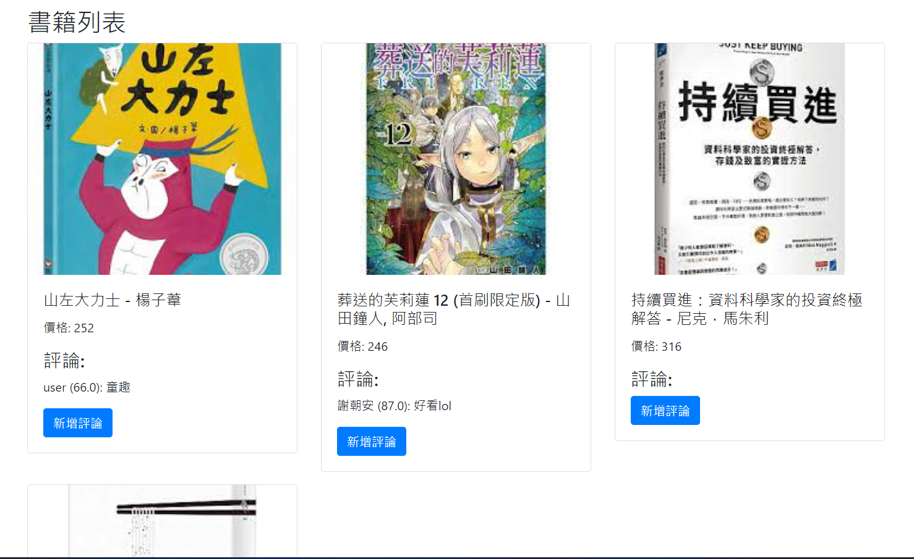

<h1>書籍系統</h1>

用於新增書籍到至MySQL server，並在另一個頁面上顯示書籍資訊及評論內容和新增評論

<h2>環境</h2>

IntelliJ

<h2>安裝指南</h2>

需安裝 Tomcat 及下載 mysql-connector 和 JSTL

<h2>使用範例</h2>

http://localhost:8080/forms/myForm.jsp)http://localhost:8080/forms/myForm.jsp : 輸入書籍 

http://localhost:8080/showBook : 顯示書籍 

<h2>資料庫</h2>

